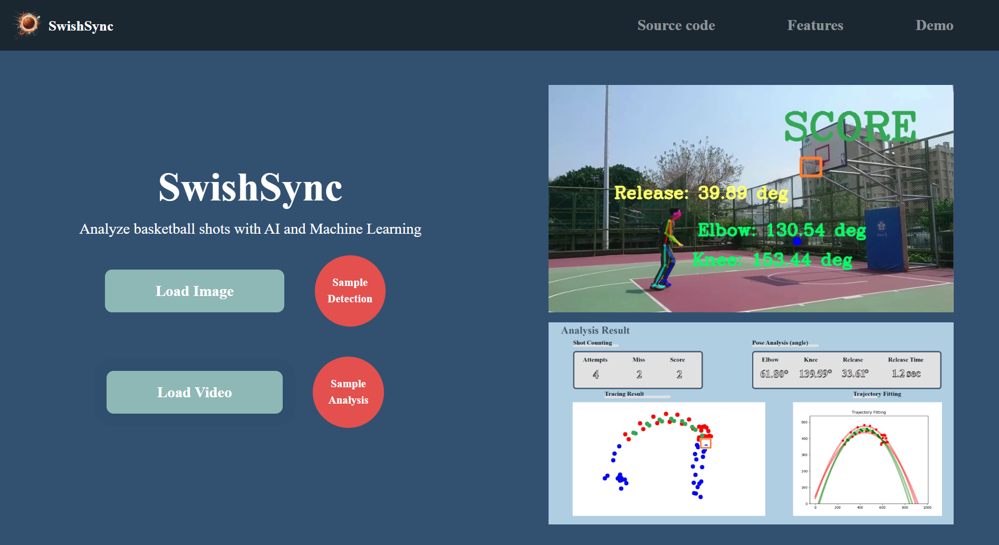
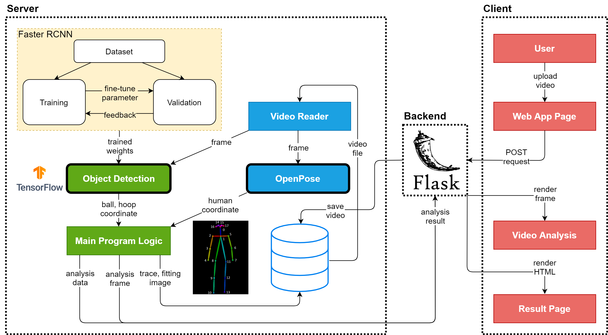

## SwishSync
> An AI and Machine Learning tool to analyze basketball shots and shooting posture

This is an artificial intelligence application built on the concept of object and pose detection. It analyses basketball shots by digging into the data collected from object detection API. This is a web app in which you can make a `POST` request with images and videos which, in return, will give you analyzed images and videos respectively. 

All the data for the shooting pose analysis is calculated and implemented using [Opencv]() and [OpenPose]().

### Getting Started

1. Get a copy of this project by running the git clone command

```bash 
    git clone https://github.com/anoushka2006/SwishSync.git
```

2. Before running the project, we have to install all the dependencies from the requirements.txt 

```bash
    pip install -r requirements.txt
```

<h3><span style="color: red">Note: </span>Please note that you need a GPU with proper set up of CUDA setup to run the video analysis, since a CUDA device is required to run OpenPose</h3>

3. Execute the web server

```bash
    python app.py
```




## Structure


